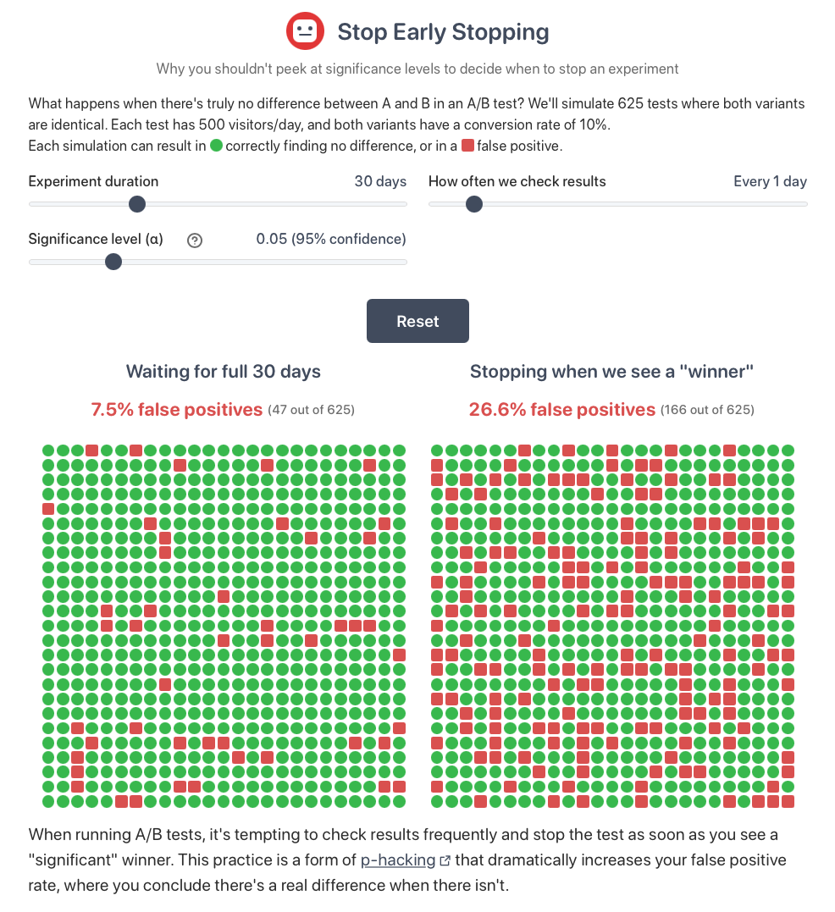

    
     
    
    
    
     
     
    
     
    <a href="https://stop-early-stopping.osc.garden">Try it yourself!</a>
     

<h3 align="center">Why you shouldn't peek at significance in A/B tests</h3>

## What is Early Stopping?

Early stopping occurs when you repeatedly check your A/B test results and stop the experiment as soon as you see a "statistically significant" result. This is a form of [p-hacking](https://en.wikipedia.org/wiki/Data_dredging#Optional_stopping) that dramatically increases false positive rates.

For example, with a significance level of 0.05 (5%), you expect a 5% false positive rate when checking just once at the end. But if you check results daily during a 30-day test, you could see false positive rates as high as 30%, meaning many of your "winning" tests are actually detecting nothing at all!

## Features

- **Interactive simulation**: See how early stopping affects false positive rates in real-time
- **Adjustable parameters**: Test different experiment durations, checking frequencies, and significance levels
- **Visual comparison**: Directly compare the false positive rates of proper testing vs early stopping

## How it works

This tool simulates A/B tests where both variants have identical performance (a true "null hypothesis" scenario):

1. Each simulation generates two identical variants with:
   - 250 visitors per day per variant
   - 10% conversion rate for both variants
   - No actual difference between variants

2. The tool runs 625 simulated tests with two different stopping criteria:
   - **Left grid**: Tests that only check for significance once, after the full duration
   - **Right grid**: Tests that check at your specified frequency and stop when significance is found

3. Results are color-coded:
   - 🟢: tests correctly showing no significant difference
   - 🟥: tests incorrectly showing a significant difference (false positives)

Statistical significance is determined using a two-proportion Z-test, mathematically equivalent to a chi-squared test for this 2×2 case.

## Contributing

Please do! I'd appreciate bug reports, improvements (however minor), suggestions…

The simulator uses vanilla JavaScript, HTML, and CSS. To run locally:

1. Clone the repository: `git clone https://github.com/welpo/stop-early-stopping.git`
2. Navigate to the project directory: `cd stop-early-stopping`
3. Start a local server: `python3 -m http.server`
4. Visit `http://localhost:8000` in your browser

The important files are:

- `index.html`: Basic structure
- `styles.css`: Styles
- `app.js`: Main UI logic
- `simulationWorker.js`: Web worker that runs simulations in background

## Need help?

Something not working? Have an idea? Let me know!

- Questions or ideas → [Start a discussion](https://github.com/welpo/stop-early-stopping/discussions)
- Found a bug? → [Report it here](https://github.com/welpo/stop-early-stopping/issues/new?&labels=bug)
- Feature request? → [Let me know](https://github.com/welpo/stop-early-stopping/issues/new?&labels=feature)

## License

This simulator is free software: you can redistribute it and/or modify it under the terms of the [GNU Affero General Public License as published by the Free Software Foundation](./COPYING), either version 3 of the License, or (at your option) any later version.
